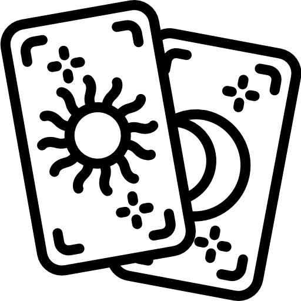

# Tarotpedia - A numerology and Tarot reader powered by AI

<p align="center" style="background-color:white;">

</p>

## Development

### API

1. Install `uv`: https://docs.astral.sh/uv
2. Setup `OPENAI_API_KEY` in `.env`.
3. Install dependencies:

   ```bash
   uv sync --all-groups --all-extras
   ```

4. Start the server:

   ```bash
   make api
   ```

5. (Optional) Start the `streamlit` for UI development:

   ```bash
   make ui
   ```

### Documentation as Code

This API documentation is generated using [mkdocs-material](https://squidfunk.github.io/mkdocs-material/) and [mkdocstrings](https://github.com/mkdocstrings/mkdocstrings) for docs-as-code.

In your codebase, you can add the `mkdocs` markdown below the Python `class`, `func`,...

```python
@app.post("/predict/interpretations", response_model=TarotAPIResponse)
async def predict_interpretations(request: TarotAPIRequest) -> TarotAPIResponse:
    """
    | Method | Path                       | Description                                       |
    | ------ | -------------------------- | ------------------------------------------------- |
    | POST   | `/predict/interpretations` | Get tarot interpretations and numerology meanings |

    Params:
        request (TarotAPIRequest): The request object containing the name, dob, question, past_card, present_card, and future_card.

    Returns:
        TarotAPIResponse: The response object containing the name, dob, question, numerology_meaning, and interpretations.

    !!! note
        This function uses the `get_gptarot_final_interpretations` and `get_numerology_meaning` functions to get the tarot interpretations and numerology meanings.
   ...
   """
   pass
```

A markdown file is need to reference to the function with syntax `::: {path_to_python_file}.{function_name}`. Then `mkdocs` will generate the API documentation for you.

## Contribute

Please fork this repo and create a pull request, I will thank you later. This is my hobby project and I hope it can help your hobbies too.

## License

This project is released under the [CC0 1.0 Universal](LICENSE) license.
